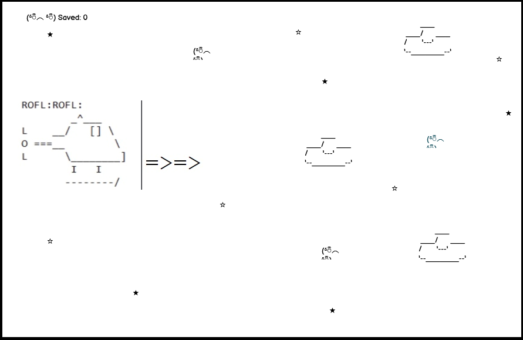
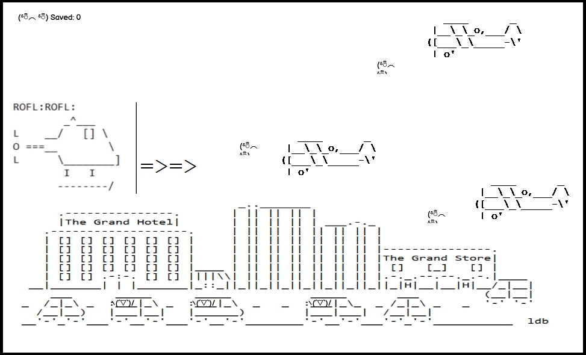
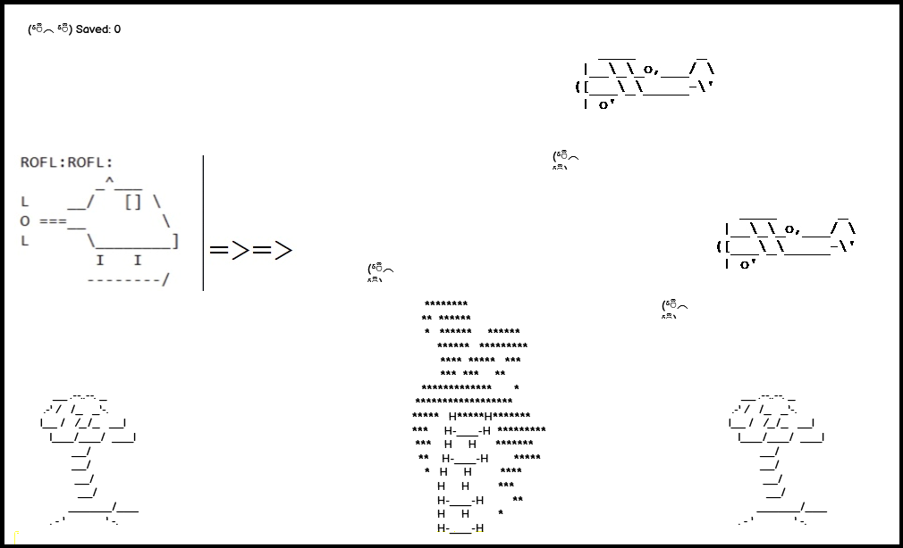

# Hofflecopter

&nbsp;


&nbsp;

## Introduction

&nbsp;

In order to celebrate World Emoji day, our team decided to explore the roots of the emoji phenomenon. We wanted to celebrate a time when emojis were simple ascii characters :-) This gave us the opportunity to tackle the challenge of creating a great looking application using a highly limited colour palette - black and white. The limitations we set upon ourselves led us to create a retro arcade game using an emoji theme. At some stage during out early team meetings, we discovered that David Hasslehoff better known as 'The Hoff' was born on World Emoji day, 17th of July. This fact led us to create a story based around the actor that suited our theme perfectly!! Our game features multiple levels, story cutscenes, scoring, a wide variety of enemies and a retro soundtrack!

&nbsp;

## Concept

A "retro emoji" shooter game. Get the bad guys. Save The Hoff.
[Play Hofflecopter Here](https://andrewdempsey2018.github.io/hoffle-copter/)

### Controls

Up, Down, Left, Right - Fly
Z - shoot
F / ESC - toggle fullscreen

---

## Project Brief

The project brief was to design a final product based around World Emoji Day - 17th July.

### Initial Concept Deployment


## Design Ideas Development

### Team Call 13/07/2022

First team call to discuss ideas.

#### Project ideas

* Some kind of static site with quiz, memory game, how do we make this innovative?
* Project based on famous personality born on World Emoji Day - The Hoff?
* Emoji game - Mario Kart type collect the emojis.
* Angry Birds with emojis.
* Social media website with a focus on emojis.

### Team Call 14/07/2022

Overview of meeting : Project decisions, repo set up, technical issues of VSCode and Git ironed out

**Project name decided upon** - Hofflecopter.

**Project decided upon** - ASCII "retro" emoji themed helicopter JavaScript game.

Main repo set up and shared. Team members forked the project to begin work. Support shared for VSCode and GitHub desktop, commands walked through for team management of merge and pull procedures.

Kanban board started and tasks assignment started.

#### Extra design decisions made Friday morning

* Levels - Beach, city, space
* Additional enemies to be added
* Add a collectible like coins etc

Long live the Hoff!

---

## User Stories

* A user should be able to load the main game.
* A user should understand the purpose of the website.
* A user should be able to activate the game.
* A user should be able to find the controls for the game.
* A user should be able to control in game sounds.
* A user should enjoy the experience of playing the game.

&nbsp;

## Wireframes

&nbsp;

### Level Backgrounds

&nbsp;

One of our main MVPs was to create multiple varied location for the player to explore. We created wireframes of the various locations using a simple paint program. This gave us a good feel for what themes would work and what would not. In the end we decided to restrict ourselves to three levels - Beach (to go with our David Hasslehoff theme), City and Space.

&nbsp;

**Space Level**
&nbsp;

&nbsp;
**City Level**
&nbsp;

&nbsp;
**Beach Level (including update)**
&nbsp;

&nbsp;


## Further Development Notes

### Project development done on Friday

* Added clouds to game canvas area
* Added blimp enemy with code
* Added cityscape background to level 2 file
* Found sound effects for project

### Project development done on Saturday

* Copper collectible added to project
* Sound files created for explosion and collectible impact
* Sprites and landscapes sourced and animated for space level
* Added event timer for levels

### Project development done on Sunday

* Fixed problem with GitHub pages deployment
* Background sound track and user controls added to project
* Work started on presentation video
* Added explosion animation
* Level selection created
* Beach level with animated birds added
* Loading screen with user instructions included in project

#### Project development done on Monday

* Improved explosion animation
* Fixed copper eating heli bug
* Added static backgrounds for all levels
* Added favicon

---

## Deployment

### Local

During development, our team used Live Server by Ritwick Dey to deploy and test locally. Live server is available for both VSCode and Gitpod at the following url: [Live server](https://marketplace.visualstudio.com/items?itemName=ritwickdey.LiveServer)

To deploy locally:

1. Clone the repo into VSCode or Gitpod: [git clone](https://github.com/andrewdempsey2018/hoffle-copter.git)
2. Install Live Server via you extensions tab
3. Right click on index.html
4. Select 'Launch with Live Server'
5. The game will launch on your default browser

### Remote

As our application did not require backend functionality, we decided to deploy to Github pages.

To deploy the application to Github pages:

1. Fork or clone the repo into your own Github account
2. Click settings
3. Click on the pages tab
4. Select the main branch as your source branch (or, another branch or  your choice if applicable)
5. Click save
6. The deployed link will be displayed
7. Click this link to be redirected to the live site [Play Hofflecopter Here](https://andrewdempsey2018.github.io/hoffle-copter/)

&nbsp;

## Technologies Used

&nbsp;

### **Kaboom.js**

We relied heavily on [Kaboom.js](https://www.kaboomjs.com/). Kaboom is an open source Javascript library that provides many functions common to game development. At its core, Kaboom provides an HTML5 canvas where all drawing takes place. This canvas is then applied to a web page. Kaboom provides tagging functionality that allows game objects to be easily manipulted via a handy reference. The library also provides excellent audio integration with common formats such as MP3 and WAV supported out of the box. There is excellent API documentation available as well as an active [Discord community](https://discord.com/invite/aQ6RuQm3TF)

&nbsp;

#### **Github**

We used a strict Git workflow throughout the Hackathon. Members created forks of the main repo before cloning locally. Commits required

&nbsp;

### Additional technologies

&nbsp;

* HTML
* CSS
* Javascript
* Git
* JS Code
* Google DevTools - used for testing and development
* Am I Responsive? - used for testing
* Canva - used for creation of Hofflecopter and Lifes a beach slides
* BFXR - Online tool for sound effect creation of explosion and coin collection tones
* Paint.net - for creation and manipulation of sprites

## Testing

### Bugs Encountered and Resolutions

* GitHub pages json issue

* Hofflecopter getting eaten by giant smiley face

### Automated Testing

* W3C Validator

* JavaScript Validator

* Lighthouse

### Manual Testing

* Testing User Stories

| A user should be able to | Proof |
|----------------------- |------ |
|Load the main game |The website loads when the deployed link is followed|
|Understand the purpose of the website |A clear loading screen is included before the game starts. With more time additional HTML functionality could be added to build more of a website around the game to add to the story of Hoffle-copter|
|Activate the game |The loading screen of the game instructs the user to click here and press enter which activates the game|
|Find the controls for the game ||
|Control in game sounds ||
|Enjoy the experience of playing the game | So HOFL very COPTER much WOW |

## Code Overview

&nbsp;

### **levelloader.js**

```bash

const loadLevel = async (level) => {
    const levelData = await fetch(level);
    return levelData.json();
}


export default loadLevel;
```

The level that is to be loaded is passed to the function as a string. This string is the complete path to the file. Data is fetched asynchronously, parsed as JSON data before being returned to the caller.

&nbsp;

### **Copper**

Hidden inside a Copper, a smiley emoji, is a reward a player gets in Hoffle-Copter game. A player gets the reward only when Copper is broken. The only thing that can break a Copper is the heli’Copter gunship, with offensive capability to engage on air targets. So every time Heli’Copter collides with Copper, the Copper is destroyed. The player’s health is then incremented by 1 and the score is incremented by 1000.


&nbsp;

### **Event timer function**

to be completed

&nbsp;

### **explode.js**


The explosion feature is possible through slicing the png file and animating through those 3 frames like so:

```bash
sliceX: 3,
    //Animation of explosion
    anims: {
        "xplod": {
            from: 0,
            to: 1,
            to: 2,
            speed: 4,
            loop: false
```

This animation is then called during the ```onCollide()``` phase of game play when a bullet sprite hits an enemy sprite.

The explosion animation is removed from screen by calling the ``` destroy() ``` function after a life counter has reduced to zero

```bash
this.life -= 1;

        if (this.life === 0) {
            this.spr.destroy();
```

## Credits

### Images

<<<<<<< HEAD

* Blimp, Alien, Star, Space background, Explosion - www.asciiart.eu
=======

* Blimp, Alien, Star, Space background, Explosion, Bird - www.asciiart.eu

>>>>>>> c460ec89f1be6e33e2f92e193e70a02abe35e17e

* Sun - www.pinclipart.com
* UFO - asciiart.website
* Copper, an ASCII art smiley face - [George Reith](https://codegolf.stackexchange.com/questions/16587/print-a-smiley-face/16857#16857)
* Flag - emojicombos.com
* Dragon - [ASCII Art](https://asciiart.cc/view/12177)

### Sounds

* Roflcopter
* Sound effects - created by Cheryl
* Royalty free chip tunes downloaded from [Proud music library](https://www.proudmusiclibrary.com/en/tag/game-boy)

## Team Members

&nbsp;

### **Andrew**

Thank you to Code Institute for giving me this opportunity to participate in the July 2022 Hackathon celebrating World Emoji Day! Thanks especially to my fellow 'Hasslehoff Hackers' team mates - we had great fun working together and the experience gave me a wonderful oppertunity to gain experience in the agile process as well as honing my Javascript skills.

[LinkedIn](https://www.linkedin.com/in/andrew-dempsey-20ab40180/)

&nbsp;

### **Cheryl**

I have really enjoyed my first Hackathon. With thanks to Code Institute, and my fellow 'Hasslehoff Hackers' for making it an enjoyable experience. This has been a great learning journey gaining new skills in Git deployment and project management through GitHub as well as learning some JavaScript and getting into some image editing.

[LinkedIn](www.linkedin.com/in/ccp84)

&nbsp;

### **Christian**

This was my first Hackathon, and what a team to work with from the get-go! The work that C.I put in behind the scenes to organise this can't go unappreciated, so a big thanks to the C.I team! As a novice coder entering my first Hackathon, I've had nothing but amazing encouragement and support from the 'Hasslehoff Hackers' and want to say I'm so grateful to work with such an amazing group! I'm really proud of the concept and work that has gone into it. This project has furthered my understanding of my current level of JS, GIT and using a new (to me) IDE - VSCode. Well done guys and thanks for the experience!!

[LinkedIn](https://www.linkedin.com/in/christian-brown-ba7741171/)

&nbsp;

### **Ethan**

To be completed

&nbsp;

### **Lucas**

I've had the pleasure of working with a great group of teammates during this hackathon. I have learned more about agile methodology and JavaScript than I ever could imagine going into the event. With great teamwork comes great things! Thank you so much to the ‘Hasslehoff Hackers’ team for making this experience one to remember!

[LinkedIn](https://www.linkedin.com/in/lucas-behrendt)

&nbsp;

### **Peter**

My second Hackathon with Code Institute. Great experience, a second time. Had great fun! Worked with such an exciting team. Together, we built what is quite an exciting game project - **Hoffle Copter!** Learnt new things along the way! Feeling like a pro already! Thanks to Code Institute for this experience. Thanks to Hoffle Copter team for being awesome - ***up the Hoff!*** I want to do this again!

[linkedIn](https://www.linkedin.com/in/panzek/)
